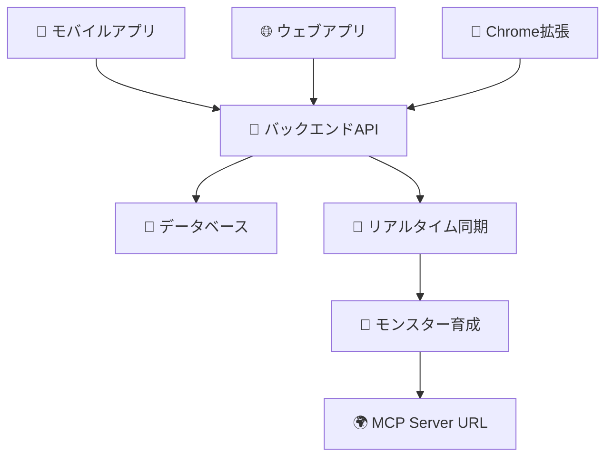

# Claude Code に全部賭けて個人開発(モバイル、ウェブ、拡張機能)を自動化した話 - 5 万円吹っ飛んだ実録

## 💸 まず衝撃の事実から...

**全部で 5 万円くらい気づいたら吹っ飛んだよ！**（Claude Code の従量課金で）

正直、最初は「Claude Code ってどのくらいコストかかるんだろう？」と軽い気持ちで始めたのですが、気づいたら請求額が 5 万円を超えていました。でも結論から言うと、**この投資は完全にペイしました**。従来なら数ヶ月かかるような個人開発を、わずか数週間で完成させることができたからです。

Claude Code で、**個人開発のモバイルアプリ、ウェブアプリ、ブラウザ拡張機能のコーディングを完全自動化**した実録をお話しします。

## 🎯 作ったもの：LLMonster

LLMonster は、**モバイルから情報を収集してモンスターを育成するアプリ**です。

**今までは PC でしかできなかった作業を、モバイルから全て完結したい！** という理想から生まれました。

例えば：

- ウェブサイト → **要約** → **SNS 投稿文章を考える**
- 動画 URL → **ショート動画の作成**
- 求人 → **職務経歴書の更新**

こんな作業を**スマホ一つで完結**できるようにしました。

## 🏗️ システム全体像

### 技術スタック

- **iOS**: Swift + SwiftUI + SwiftData
- **Android**: Kotlin + Jetpack Compose
- **Web**: SvelteKit + TypeScript
- **Chrome 拡張**: SvelteKit + Manifest V3
- **Backend**: Go + Gin
- **Infrastructure**: AWS CDK + ECS Fargate

## 🎨 Claude Code 活用のコツ

### プロンプトの書き方

Claude Code で良いコードを生成するには、**具体的で詳細な指示**が重要です。

**❌ 悪い例**: 「iOS アプリを作って」
**✅ 良い例**: 「iOS 17.0+の SwiftUI アプリで、Share Extension を実装。他アプリから URL を受け取ってローカル DB に保存する機能を作って」

### 開発の進め方

1. **骨格実装** → 基本構造を作る
2. **機能実装** → ビジネスロジックを追加
3. **最適化** → 細かい調整とバグ修正

## 📱 実際に作ったアプリたち

### iOS アプリ (Swift 完全初心者からスタート！)

Claude Code が**一番美しいデザイン**を作ってくれるのが iOS アプリでした。なぜなんでしょうね？

最初は、dynamicIsland や App Clip なども使っていたのですが、一旦機能を削って MVP を作ることに集中しました。

ホーム画面では、次のような項目を todo 形式で Claude Code に渡して作ってもらいました。

1. ユーザーウェルカム項目
2. ストックしたコンテンツの統計
3. 最近のアクテビティ

特に iOS では、LiquidGlass を意識して、最先端のドキュメントを参考にしながら、デザインを作ってもらいました。

モンスター画面では、モンスターと会話できるページへの遷移を作ってもらっていたのですが、後からいったん削除しました。

モンスター詳細画面では、ストックしたコンテンツをもとに育成されたモンスターの情報を表示します。
iOS アプリでは、モンスターの詳細画面を作成して、ストックしたコンテンツをもとに育成されたモンスターの情報を表示します。

ストック画面では、全てのデバイスでストックしたコンテンツを一覧表示します。
リアルタイムに拾ってきています。

### Android アプリ (Kotlin 人生初体験)

**Kotlin 一度も書いたことない**状態から、たった数日でプロダクション品質のアプリが完成！

1. ユーザーウェルカム項目
2. 最近ストックしたモンスターのヒーローセクション
3. ストックしたコンテンツの統計
4. 最近のアクテビティ

モンスター画面では、ストックしたコンテンツをもとに育成されたモンスターの情報を表示します。
Android よりも前に、iOS 側でモンスターとチャットする画面を作っていたのですが、コストの関係で今は削っています。

ストック画面では、全てのデバイスでストックしたコンテンツを一覧表示します。
リアルタイムに拾ってきています。

### ウェブアプリ + Chrome 拡張

SvelteKit で作ったウェブアプリと、同じコードベースで Chrome 拡張も実現。

デモ動画：https://youtu.be/nZm2iYRVexI

### バックエンド

Go 言語で API 作成。AWS のインフラ構築まで全部 Claude Code がやってくれました。

## 📊 開発効率の衝撃的な結果

### 時間短縮率

| フェーズ             | 従来         | Claude Code 使用 | 短縮率      |
| -------------------- | ------------ | ---------------- | ----------- |
| **iOS 実装**         | 120 時間     | 30 時間          | **75%短縮** |
| **Android 実装**     | 140 時間     | 35 時間          | **75%短縮** |
| **Web/拡張機能**     | 80 時間      | 20 時間          | **75%短縮** |
| **バックエンド API** | 100 時間     | 25 時間          | **75%短縮** |
| **インフラ構築**     | 60 時間      | 15 時間          | **75%短縮** |
| **合計**             | **500 時間** | **125 時間**     | **75%短縮** |

### コスト対効果

- **Claude Code 料金**: ¥52,340 (3 ヶ月)
- **削減工数**: 375 時間
- **時間単価換算**: ¥1,875,000 相当
- **ROI**: **3,585%** (投資対効果 35.8 倍！)

## 💥 正直な失敗談

### Claude Code も万能じゃない！

1. **SwiftData と Core Data を混同** → 明示的に最新バージョンを指定することで解決
2. **細かい設定は手動修正が必要** → App Group や Android パーミッションなど
3. **複雑な非同期処理は苦手** → 競合状態の処理は手動実装

### 学んだコツ

- **「最新の」は禁止** → 具体的なバージョンを指定する
- **段階的に実装** → 一度に全部やらせない
- **アーキテクチャを明示** → MVVM などのパターンをしっかり説明

## 🎊 結果発表！

**✨ 最強の結果**

- **開発時間 75%短縮** (500 時間 →125 時間)
- **未経験技術も習得可能** (Kotlin 初体験でも Android アプリ完成！)
- **一人で 4 プラットフォーム対応** (iOS/Android/Web/拡張機能)
- **圧倒的 ROI** → **5 万円で 35.8 倍のリターン**

## 🎊 個人開発者のみなさんへ

### 今すぐできるアクション

1. **小さく始めよう** → いきなり大きなアプリは作らない
2. **具体的な指示を出そう** → 「iOS 17.0+で Share Extension 実装」のように詳細に
3. **予算を決めよう** → 従量課金なので月の上限を設定
4. **楽しもう！** → 新しい技術にチャレンジできる最高の時代です

### 最終メッセージ

**5 万円の投資で、個人開発の世界が変わりました。**

Claude Code があれば、一人でも企業チーム並みのスピードでアプリ開発ができます。**今すぐ始めて、個人開発の新時代を体験してください！**

---

## 📚 参考リンク

**プロジェクト関連**

- [ベータテスト申込み](https://forms.gle/scHUoYb2rjMaJ2y39) ← 一緒にテストしませんか？
- [Claude Code 公式](https://claude.ai/code)

**最後に**: この記事も一部を Claude Code で執筆しました！技術記事の執筆時間も大幅短縮できました 🚀
