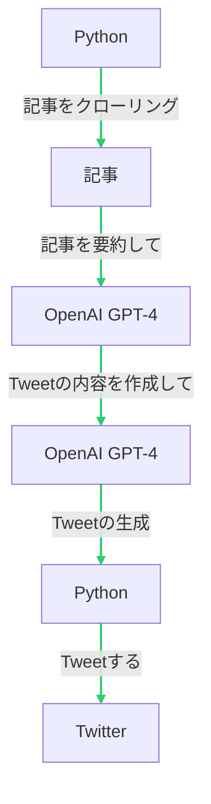

# はじめに

こんにちは、[@ekusiadadus](https://twitter.com/ekusiadadus)です。

今回は、GPT-4 を使って記事の要約をしてバズる Tweet を作成+投稿する bot の作り方を紹介します。
特に、GPT-4 を使用して Tweet の記事を要約する箇所に関しては、Microsoft が最近公開した[Guidance](https://github.com/microsoft/guidance)を使用しています。
一般的には、LangChain を使う人が多いと思いますが、興味で Guidance を使ってみました。

使用する主な技術は以下の通りです：

- [OpenAI GPT-4](https://openai.com/blog/openai-api/)
- [ChatGPT Plugins](https://openai.com/blog/chatgpt-plugins)
- [Python](https://www.python.org/)
- [Tweepy](https://www.tweepy.org/)
- [Twitter API](https://developer.twitter.com/en/docs/twitter-api)
- [Guidance](https://github.com/microsoft/guidance)

https://openai.com/blog/openai-api/

https://github.com/microsoft/guidance

## 手順 with ChatGPT Plugins



## 手順の解説

基本的には、ほとんど上の通りなのですが、一部記事にランキングを付けて、ランキングの高い記事を GPT-4 に要約してもらうようにしています。
この箇所は、今回は省いていますが、MeCab で分ち書きをして自分の好きなトピックの記事が高いランキングになるようにしています。
ちなみに、学習済み言語ベクトルには、Meta が公開している [fastText](https://github.com/facebookresearch/fastText)を使用しています。

https://github.com/facebookresearch/fastText

### 1. 記事をクローリング

この手順では、最新の記事をクローリングしてきます。
クローリングする際は、そのサイトの利用規約を確認してください。

### 2. 記事を要約して+Tweet の内容を作成して

記事を GPT-4 に要約してもらいます。
この箇所で、Guidance を使用しています。

1. GPT-4 に専門家に成りきってもらいます
2. GPT-4 に記事の要約をしてもらいます
3. GPT-4 に Tweet の内容を作成してもらいます

3 のプロンプトで、「インフルエンサーになりきって」等を最初は付けていたのですが、あまりにもスパム感がでてしまうので、諦めました。

```python
import guidance


class GuidanceClient:
    def __init__(self, model_name):
        ...
        self.llm = guidance.llms.OpenAI(model_name)

    def _get_max_tokens(self, model_name):
      ...

    def generate_experts_tweet(self, query):
        experts = guidance(
            """
            {{#system~}}
            あなたは、とてもわかりやすい解説者です。
            {{~/system}}

            {{#user~}}
            以下の内容を、わかりやすく箇条書きで解説してください。
            {{query}}
            この質問に答えるのに最適な世界的な専門家（過去または現在）を3人挙げてください。まだ質問に答えないでください。


            {{~/user}}

            {{#assistant~}}
            {{gen 'expert_names' temperature=0 max_tokens=512}}
            {{~/assistant}}

            {{#user~}}
            1.Tweetの文字制限を必ず守ってください。
            1. Link: <https://> が含まれている場合は、そのリンクを回答に含めてください。
            2. 専門家の名前は絶対に回答に含めないでください。
            Tweetの内容は、上記の点に気を付けて日本語で書いてください。
            Tweetの文字制限を必ず守ってください。
            {{~/user}}

            {{#assistant~}}
            {{gen 'answer' temperature=0 max_tokens=512}}
            {{~/assistant}}
            """,
            llm=self.llm,
        )
        output = experts(query=query)
        return output["answer"]
```

### 3. Tweet の生成

この箇所では、素直に Tweepy を使用しています。

今回は、自作した TweetClient の一部を抜粋しています。

```python

class TweetClient:
    def __init__(
        self,
        consumer_key,
        consumer_secret,
        access_token,
        access_token_secret,
        bearer_token,
    ):
        self.client = tweepy.Client
        ....

    class Streamer:
      ...

def create_tweet_ekusiadadus(self, text):
    try:
        self.client.create_tweet(text=text)
    except Exception as e:
        print(e)

def create_url(self):
  ...
    tweet_fields = "tweet.fields=author_id,created_at,entiti

```

### BOT の実行

最後に、cron で定期実行するようにしています。

```cron
40 * * * * /home/ekusiadadus/dev/atweet/.venv/bin/python /home/ekusiadadus/dev/atweet/main.py >> /home/ekusiadadus/cron.log
```

ちゃんとやるなら、Docker で作成して、CloudRun or Lambda で動かすと良いと思います。

### やり残したこと

- 画像を添付する
- リツイートする
- DB への永続化 (dynamo+sqlite でやりました)
- キャッシュ
- 記事のランキングの向上

## 免責事項

この記事は、GPT-4 を使った記事の要約と Tweet 生成ボットの作成方法を教示するためのものです。しかしながら、この情報を利用して実際にボットを作成・運用した結果について、私 [@ekusiadadus](https://twitter.com/ekusiadadus) および記事の提供者はいかなる責任も負いません。

特に Web スクレイピングやツイートの自動投稿といった活動は、対象となるウェブサイトや Twitter の利用規約に違反する可能性があります。それらの規約は国や地域、時間によって変化する可能性があり、利用者自身が最新の情報を確認し遵守する責任があります。

また、このボットが生成するコンテンツの品質、適切さ、法令遵守等についても、ユーザー自身が責任を負うものとします。これには、ボットが生成する Tweet が第三者の著作権を侵害しないか、名誉毀損とならないか、プライバシーを侵害しないか等を確認する責任も含まれます。

疑問や不確かな点がある場合は、法的なアドバイスを受けることを強く推奨します。
